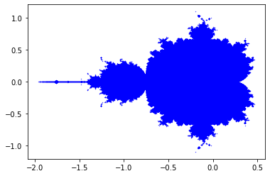

## Mandelbrot con python


El fractal de Mndelbrot es un conjunto de numeros reales c, para que que al iterar la funcion:

-  

c no escapa al infinito de forma repentina.

Si para un valor de c, retorna una sucesion divergente, entonces c no forma parte del conjunto de mandelbrot.

Ejemplo:

Si c = 1, la ecuacion va a retornar la siguiente sucesion de numeros --> 0, 1, 2, 5, 26, …que diverge.

Por otro lado, si c = -1, entonces la sucesion retornara --> 0, –1, 0, –1, …formando c parte del conjunto mandelbrot.

Para el conjunto de Mandelbrot, se empieza teniendo en cuenta que: -  

Por consiguiente:

-  <br />
-  <br />
-  <br />
#### <pre>                    ... </pre>

Hasta este punto, ya sabemos que para cada valor de c, tendremos 2 posibilidades, que forme parte del conjunto(que no escape al infinito), o que no forme parte(que escape al infinito). Ademas se sabe que cuando c forma parte del conjunto de mandelbrot, el valor absoluto de Zn(Es decir su distancia desde el origen) no supera el valor de 2.

La idea es iterar sobre cada uno de los pixeles en un plano imaginario, asignandole a c el valor de dicho pixel, comprobando asi si este forma o no parte del conjunto. Si coloreamos cada pixel segun si pertenece o no al conjunto de Mandelbrot, obtendremos el famoso fractal.  


```python
from pylab import *
from numpy import arange

iterations = 50

m_x = []
m_y = []

def mandelbrot(c):
    z0 = 0
    f = z0**2 + c
    for z in range(iterations):
        if abs(f) > 2.0:
            return False
        else:
            z0 = f
            f = z0**2 + c
    return True
  
for x in arange(-2.0, 2.0, 0.001):
    for y in arange(-2.0, 2.0, 0.001):
        c = complex(x, y)
        if mandelbrot(c):
            m_x.append(x)
            m_y.append(y)

scatter(m_x,m_y, s=0.1 ,marker='o', c='b')

show()
            
```





```python

```
