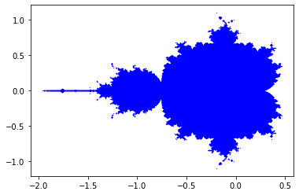

## Mandelbrot con python

```python
from pylab import *
from numpy import arange

iterations = 50

m_x = []
m_y = []

def mandelbrot(c):
    z0 = 0
    f = z0**2 + c
    for z in range(iterations):
        if abs(f) > 2.0:
            return False
        else:
            z0 = f
            f = z0**2 + c
    return True
  
for x in arange(-2.0, 2.0, 0.001):
    for y in arange(-2.0, 2.0, 0.001):
        c = complex(x, y)
        if mandelbrot(c):
            m_x.append(x)
            m_y.append(y)

scatter(m_x,m_y, s=0.1 ,marker='o', c='b')

show()
            
```





```python

```
